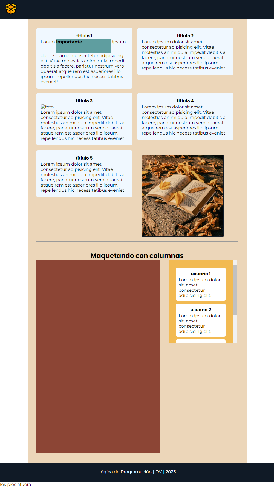

# Clase 11 - Box Model

## 📌Temas de Hoy
- Elementos de Bloque y de Línea
- Overflow
- Maquetado

## 📌 Recursos

- [Paquete iconos creados por Hilmy Abiyyu A. - Flaticon](https://www.flaticon.es/iconos-gratis/paquete)

- Paleta de colores

| Color | Código|
| :--- | :----: |
| Negro | #F2BA52 |
| Amarillo | #F29849 |
| Naranja | #F29849  |
| Marron1 | #BF5934  |
| Marron2 | #8C4535  |


``` css
section {
    background-color: aliceblue;
    padding: 16px;
    margin-bottom: 16px;
    border-radius: 5px;
    width: 350px;
    display: inline-block;
    vertical-align: top;
    margin-right: 15px;
}
```

## Captura
